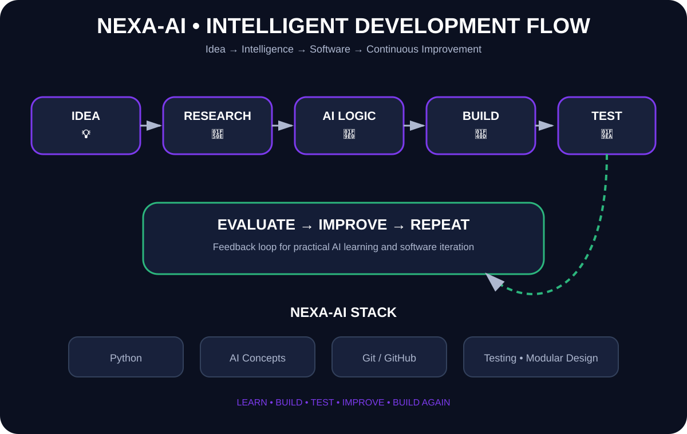

<div align="center">


[](https://www.python.org/)
[](#)
[](#)
[](https://github.com/sakshi01-art)

</div>

---

## 🧠 About NEXA-AI

**NEXA-AI** is a practical AI learning and development space focused on turning ideas into working software with **Python, intelligent features, and modular design**.

> 💡 **Think → Experiment → Build → Test → Improve**

The repository is designed to evolve as new AI concepts and application features are implemented.

---

## 🎨 Project Visual

<p align="center">
  
</p>

> **Visual:** Idea → AI logic → build → test → evaluate → improve.

---

## ✨ What This Project Focuses On

<div align="center">

| 🤖 AI | 🐍 Python | 🧩 Engineering | 🧪 Iteration |
|:---:|:---:|:---:|:---:|
| Intelligent ideas | Practical coding | Modular design | Test & improve |
| AI concepts | Automation | Maintainability | Continuous learning |

</div>

---

## 🏗️ AI Development Pipeline

```text
             💡 IDEA
                │
                ▼
          🔎 RESEARCH
                │
                ▼
       🧠 AI CONCEPT / LOGIC
                │
                ▼
            🐍 BUILD
                │
                ▼
            🧪 TEST
                │
                ▼
          📊 EVALUATE
                │
                ▼
          🚀 IMPROVE
                │
                └──────────────► 🔁 NEXT ITERATION
```

---

## 🛠️ Tech Stack

<p align="center">

</p>

<div align="center">


</div>

---

## 📁 Repository Structure

```text
NEXA-AI/
├── README.md
└── project files
```

As implementation grows, the structure can be expanded into separate modules for AI logic, interfaces, utilities, tests, and configuration.

---

## 🚀 Getting Started

```bash
git clone https://github.com/sakshi01-art/NEXA-AI.git
cd NEXA-AI
```

> ℹ️ Add project-specific dependencies and execution commands here as the core implementation is finalized.

---

## 🗺️ Development Roadmap

- [x] Repository foundation
- [x] Professional README
- [x] Animated project presentation
- [x] Development workflow documentation
- [ ] Implement core AI functionality
- [ ] Add interactive interface
- [ ] Add automated tests
- [ ] Add CI workflow
- [ ] Add demo screenshots / GIF
- [ ] Add detailed project documentation

---

## 🌟 Project Philosophy

NEXA-AI is about **learning by building** — taking an idea, understanding the underlying concept, implementing it, testing it, and improving it step by step.

<div align="center">

**💡 Learn → 🛠️ Build → 🧪 Test → 🚀 Improve**

</div>

---

## 👩‍💻 Author

**Sakshi Taragi**

[](https://github.com/sakshi01-art)
[](https://www.linkedin.com/in/sakshi-taragi-6aa019435)

<div align="center">


⭐ **Star the repo if you enjoy the journey!**

</div>


---

## 🔥 Latest Update — 20 September 2026

- Refreshed the project documentation and presentation.
- Kept the architecture and development roadmap clear for future modules.
- Continuing practical implementation and incremental improvements.


## 🔥 Latest Update — 22 September 2026

- Added a dedicated development-workflow guide under `docs/`.
- Clarified the project focus on practical AI/Python learning and incremental implementation.
- Next focus: concrete core AI functionality, tests, and modularization.

